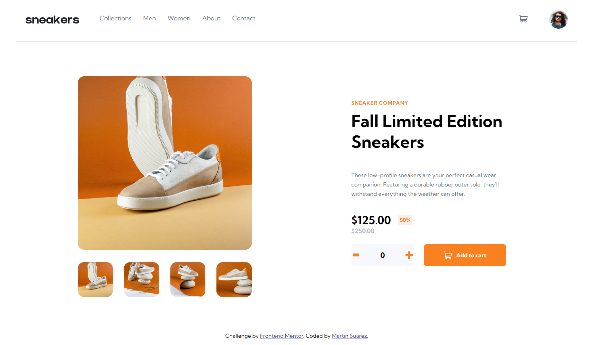

# Frontend Mentor - E-commerce product page solution

This is a solution to the [E-commerce product page challenge on Frontend Mentor](https://www.frontendmentor.io/challenges/ecommerce-product-page-UPsZ9MJp6). Frontend Mentor challenges help you improve your coding skills by building realistic projects.

## Table of contents

- [Overview](#overview)
  - [The challenge](#the-challenge)
  - [Screenshot](#screenshot)
  - [Links](#links)
- [My process](#my-process)
  - [Built with](#built-with)
  - [What I learned](#what-i-learned)
  - [Continued development](#continued-development)
  - [Useful resources](#useful-resources)
- [Author](#author)
- [Acknowledgments](#acknowledgments)

**Note: Delete this note and update the table of contents based on what sections you keep.**

## Overview

### The challenge

Users should be able to:

- View the optimal layout for the site depending on their device's screen size
- See hover states for all interactive elements on the page
- Open a lightbox gallery by clicking on the large product image
- Switch the large product image by clicking on the small thumbnail images
- Add items to the cart
- View the cart and remove items from it

### Screenshot



### Links

- Solution URL: [https://www.frontendmentor.io/solutions/responsive-product-page-with-html-sass-and-javascript-xx_P52BL2X]
- Live Site URL: [https://martin086.github.io/ecommerce/]

## My process

### Built with

- HTML5
- SASS/SCSS
- Flexbox
- CSS Grid
- Mobile-first workflow
- JavaScript

### What I learned

Putting into practice several mixins within SASS for responsive behaviour. Also programming a specific function for applying price, quantity and total dinamically within cart modal.
Overall, this challenge required applying all the learnings from my web development lessons and helped me gain a lot of practice with JavaScript.

```html
<h1>Some HTML code I'm proud of</h1>
```
```css
@mixin responsive($size) {
    @if $size == mobile {
        @media (max-width: 375px) { @content; }
    } @else if $size == desktop {
        @media (min-width: 1440px) { @content; }
    }
}
```
```js
function drawProductInModal(){
    productContainer.innerHTML = `
        <div class="cart-modal__details-container">
            
            <div>
            <p class="cart-modal__product">Autumn Limited Edition...</p>
            <p class="cart-modal__price">$125.00 x 3 <span>$375.00</span></p>
            </div>
            
        </div>
        <button class="cart-modal__checkout">Checkout</button>`
    deleteProduct();
    let priceModal = document.querySelector('.cart-modal__price');
    priceModal.innerHTML = `$${actualPrice} x ${lastQuantity} <span>$${lastQuantity * actualPrice}</span>`;
}
```

### Continued development

Still need to broader my knowledge with JavaScript and practice simpler ways to apply SASS for responsive sites.

### Useful resources

## Author

- GitHub - [https://github.com/martin086]
- Frontend Mentor - [https://www.frontendmentor.io/profile/martin086]
- Linkedin - [https://www.linkedin.com/in/martinsuarez/]

## Acknowledgments

